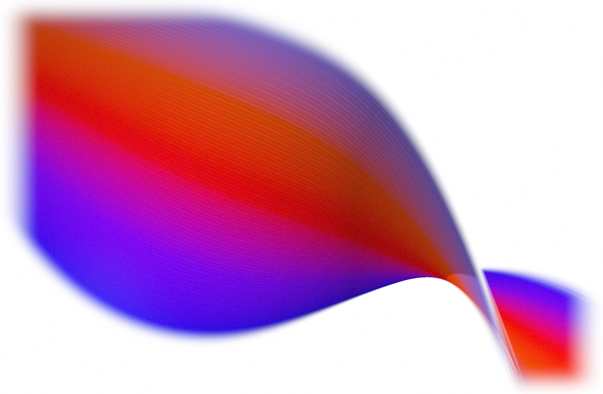

# 🌊 Wave Studio

Design 3D gradient waves in your browser: the glossy, twisting _wave of light_ from Stripe's designs. Tweak one live, then export a code snippet that drops straight into your app.

**▶ [Open the studio](https://wave-studio.pages.dev)** · runs in the browser, nothing to install.



## ⚡ From studio to site in 4 steps

1. **Play.** [Open the studio](https://wave-studio.pages.dev) and tweak a preset until it looks right.
2. **Export.** Click **⟨⟩ Export code**, pick your framework, and hit **Copy**. Grab **Download poster.png** while you're there.
3. **Install.** The snippet's top line is the command to run, e.g. `pnpm add @wave3d/react three`.
4. **Paste.** Drop the snippet into your app. What you saw in the studio is what renders.

Your exact config is baked into the snippet, so there's nothing to wire up.

## 🎛️ What the studio does

A wave is a strip swept along a curve, driven by one JSON config. The panel lets you:

- **Shape** it: spine sweep, twist, taper, width, edge feather, and light.
- **Color** it: linear, radial, conic, or mesh gradients, palettes, and image maps.
- **Finish** it: grain, blur, glow, sheen, and hue / contrast / saturation.
- **Layer** it: multiple strands with per-strand overrides, plus presets, randomize, and undo/redo.

Prefer to run it locally? `pnpm install && pnpm dev` opens the studio at the printed localhost URL (needs Node 18+ and [pnpm](https://pnpm.io)).

## 📤 Exports

Pick a size in **Output**, then export any of these:

| Export             | What you get                                                                                                                           |
| ------------------ | -------------------------------------------------------------------------------------------------------------------------------------- |
| **⟨⟩ Code**        | A copy-paste snippet for React, Vue, Svelte, vanilla JS, or a CDN `<script>`, with your config baked in and an optional inline poster. |
| **📷 Image**       | An exact-size PNG, WebP, or JPEG still. PNG and WebP keep transparency.                                                                |
| **🎬 Video / GIF** | A WebM or MP4 clip, an animated GIF, or a full-color animated WebP.                                                                    |
| **🔗 Embed**       | A self-contained `.html` page with the runtime inlined. Nothing else to ship.                                                          |
| **🖼️ Wallpaper**   | A folder of device-sized stills for desktop and mobile.                                                                                |
| **⚙️ Config**      | The `.json` config. Save it, reload it, or copy a share link.                                                                          |

## 📦 Drop it into your own site

Skipping the studio? The engine ships as framework-agnostic packages:

```sh
pnpm add @wave3d/react three     # React
pnpm add @wave3d/element three   # <wave-3d> for Vue, Svelte, or plain HTML
```

```tsx
import { Wave3D } from "@wave3d/react";

<Wave3D preset="Hero" poster="/wave.png" style={{ width: 480, height: 270 }} />;
```

Or one `<script>` from a CDN, with three bundled in:

```html
<script type="module">
  import { mountWave } from "https://esm.sh/@wave3d/core/standalone";
  mountWave(document.getElementById("wave"), {
    /* your exported config */
  });
</script>
```

Every package is poster-first: it shows a still, then upgrades to live WebGL only when the browser can handle it, and falls back to the poster on no-WebGL, Save-Data, reduced motion, or a lost context. `three.js` is code-split out of the initial load.

`three` is a peer dependency (`>=0.180 <1`); add `@types/three` for TypeScript. Per-package docs: [`@wave3d/core`](packages/core), [`@wave3d/react`](packages/react), [`@wave3d/element`](packages/element).

## 🛠️ How it works

Each strand is a wave swept along a smooth curve, carried by parallel transport, twisted around the tangent, and extruded to a tapering width, then colored by a gradient with a satin sheen and a soft-focus blur. The renderer, the studio panel, and every export all read from the same config. As a background it behaves: it clamps DPR, pauses when offscreen or hidden, and honors `prefers-reduced-motion`.

## 🚀 Deploy & release

CI deploys the studio to Cloudflare Pages on `main`, and [Changesets](https://github.com/changesets/changesets) publishes the `@wave3d/*` packages to npm. Setup lives in [DEPLOY.md](DEPLOY.md).

## Credits

Built by [Amir Abushanab](https://github.com/Amir-Abushanab) with [Three.js](https://threejs.org), [Tweakpane](https://tweakpane.github.io/docs/), and [Vite](https://vitejs.dev).

## License

[MIT](./LICENSE)
